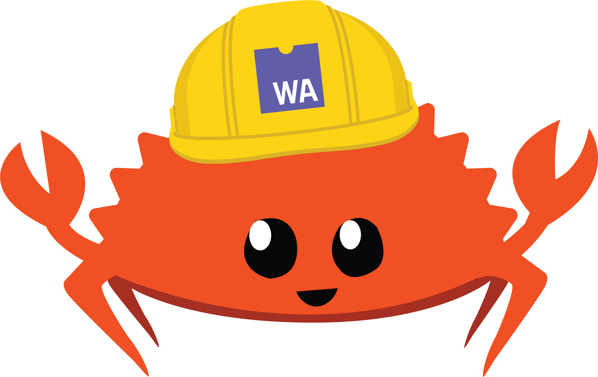

### Hi there 👋 I'm Zoe

✨ 我是一名前端开发者
✨ I want to be an interesting person

- 🎄 I’m currently working on Hangzhou
- 🦀 I’m currently learning **Rust**
- 📒 Here are my [Notes](https://missgwen.github.io/MissGwen/)
- 💬 If you have any questions, you can come to me [Here](https://github.com/MissGwen/MissGwen/issues)
- ⏱️ A [TimerTask](https://www.npmjs.com/package/timertasks) management tool,hope it helps you.

### language

### framework

### other

### database

