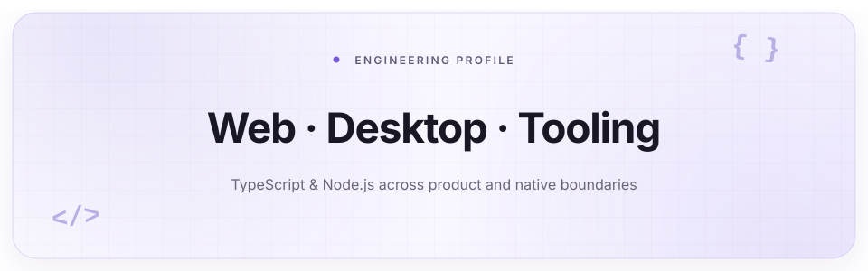

<picture>
  <source media="(prefers-color-scheme: dark)" srcset="./image/profile-header-dark.svg">
  <source media="(prefers-color-scheme: light)" srcset="./image/profile-header-light.svg">
  
</picture>

 

I'm a full-stack developer based in **Hangzhou**. TypeScript and Node.js are
where I work fastest, across React/Vue web apps and Electron/Tauri desktop
software.

I enjoy problems that cross runtime boundaries — from browser to Node.js, and
from TypeScript to Rust or native OS APIs. Most projects here began as tools I
needed myself.

 

  <picture>
    <source media="(prefers-color-scheme: dark)" srcset="https://skillicons.dev/icons?i=ts%2Cnodejs%2Crust%2Creact%2Cvue%2Celectron%2Ctauri%2Cpostgres%2Cdocker&amp;theme=dark">
    
  </picture>

 

  Hangzhou · <a href="https://missgwen.github.io/blog/">missgwen.github.io/blog</a>

